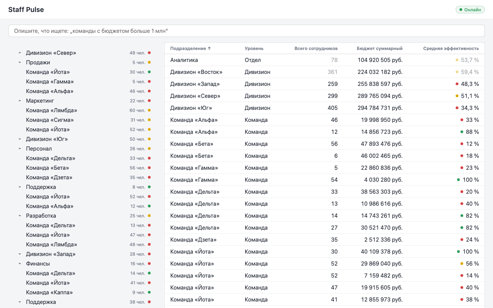
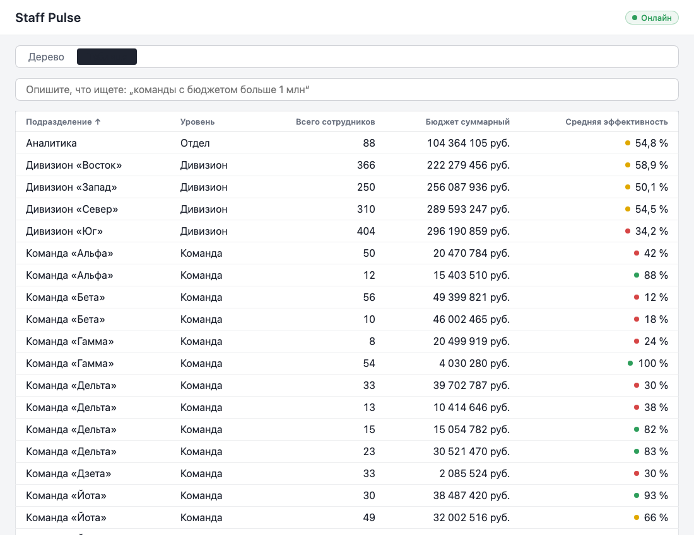
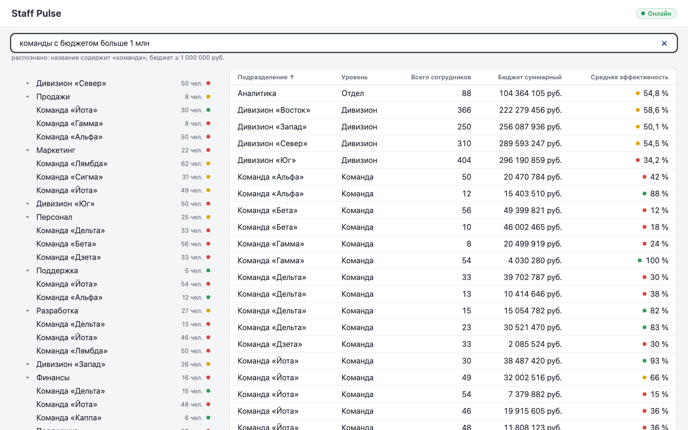

# Staff Pulse — дашборд мониторинга орг-структуры

Тестовое задание: `staff_pulse_assignment.pdf` (frontend · react · typescript · дедлайн 2–3 дня).

Интерактивное дерево орг-структуры (дивизионы → отделы → команды) + аналитическая таблица
с агрегированными показателями (численность, бюджет, эффективность) и live-обновлениями.

## Скриншоты

| Дашборд (split-view)                       | Таблица агрегатов                      | AI-поиск                                    |
| ------------------------------------------ | -------------------------------------- | ------------------------------------------- |
|  |  |  |

На третьем снимке — естественный язык: `команды с бюджетом больше 1 млн` →
структурированный фильтр + hint «распознано: …».

Снять скриншоты заново (прод-стек на :8080):

```bash
docker compose up --build -d
pnpm dlx playwright@latest screenshot --viewport-size="1440,900" --wait-for-timeout=4000 \
  http://localhost:8080 docs/screenshots/dashboard.png
docker compose down
```

## Запуск

**Production (одна команда):**

```bash
docker compose up --build   # nginx :8080 (клиент + API + SSE за прокси)
```

**Development:**

```bash
pnpm install
pnpm dev        # клиент :5173 + сервер :4000
```

## Стек

- **Клиент:** React 19, Vite 8, TypeScript 7 (native, strict), styled-components v6, TanStack Query v5, zod
- **Сервер:** Node 22, Express (mock API + SSE-стрим обновлений)
- **Тесты:** Vitest + React Testing Library
- **Качество:** Oxlint + Oxfmt (type-aware через tsgolint/TS7), husky pre-commit
- **Prod:** Docker Compose, Nginx (gzip, прокси API), бюджет бандла ≤ 200 КБ gzip

## AI в разработке

Проект разрабатывался мультиагентным процессом: ~95% кода сгенерировано AI, архитектурные
решения и приёмка — контроллером/ревьюерами. Что именно генерировали, что переписали руками
и почему (три архитектурных дефекта, пойманных только ревью; баг nginx, пойманный только
live-проверкой) — в [`docs/ai.md`](docs/ai.md).

## Тесты и проверки

```bash
pnpm test          # unit-тесты (включая агрегацию)
pnpm build         # production-сборка
pnpm check:size    # бюджет бандла ≤ 200 КБ gzip
```

### Разработка: линт и формат

`pnpm lint` / `pnpm lint:fix` — **Oxlint** (Rust, конфиг `.oxlintrc.json`), `pnpm format` / `pnpm format:check` — **Oxfmt** (конфиг `.oxfmtrc.json`: 100 колонок, одинарные кавычки). Pre-commit хуск автоматически прогоняет `lint-staged` (oxlint --fix + oxfmt) по staged-файлам при каждом коммите.

Почему Oxlint + Oxfmt, а не ESLint + Prettier: оба инструмента написаны на Rust — линт репо идёт за сотни миллисекунд; type-aware правила (no-floating-promises, no-misused-promises, no-unsafe-\* и т.д.) выполняет tsgolint поверх typescript-go (**TS7 native**), то есть тот же тулчейн, что и `tsc` в репо — никакой side-by-side пин TS 6 (бывший `.pnpmfile.cjs`) не нужен. Подавления — только узкие inline-комментарии `oxlint-disable-next-line` с причиной.

## Структура документации

| Документ                                       | Назначение                                                                                      |
| ---------------------------------------------- | ----------------------------------------------------------------------------------------------- |
| [`docs/architecture.md`](docs/architecture.md) | Слои приложения, поток данных от API до UI                                                      |
| [`docs/data-model.md`](docs/data-model.md)     | Дерево, алгоритм агрегации, контракт SSE-патча                                                  |
| [`docs/plan.md`](docs/plan.md)                 | План реализации по этапам `step/1..4`                                                           |
| [`docs/PROGRESS.md`](docs/PROGRESS.md)         | Git story: что сделано и каким коммитом                                                         |
| [`docs/adr/`](docs/adr)                        | ADR — нетривиальные решения (контекст → решение → альтернативы → последствия)                   |
| [`docs/ai.md`](docs/ai.md)                     | Раздел «AI в разработке» (требование задания): что генерировали, что переписали руками и почему |

## Правила работы (наш процесс)

1. Требования задания — **необходимый минимум**; поверх — лёгкий инженерный слой (ADR фиксируют, что именно и зачем).
2. Каждый этап задания = отдельная точка в истории: коммиты этапа завершаются тегом `step/N`.
3. Коммиты — [Conventional Commits](https://www.conventionalcommits.org/ru/): `feat:`, `fix:`, `test:`, `docs:`, `chore:`, `refactor:`.
4. После каждого коммита запись добавляется в `docs/PROGRESS.md` (commit hash, что сделано, какие требования закрыты).
5. TDD для доменной логики (агрегация, кэш-инвалидация, парсинг патчей): тест → реализация → рефакторинг.

## Карта этапов

- [x] **step/1 FOUNDATION** — ✅ scaffold, mock API, валидация, кэш (stale 5s), дерево, состояния
- [x] **step/2 CORE** — ✅ таблица агрегатов, сортировка, фильтр 250мс, связь таблица↔дерево
- [x] **step/3 POLISH** — ✅ SSE-патчи, fade-out ячеек, инкрементальная агрегация, backoff, keyboard nav
- [x] **step/4 BONUS** — ✅ Docker, Nginx, бюджет бандла, AI-поиск (NL → структурированный фильтр)

Все четыре этапа завершены. Актуальный статус — в [`docs/PROGRESS.md`](docs/PROGRESS.md).
